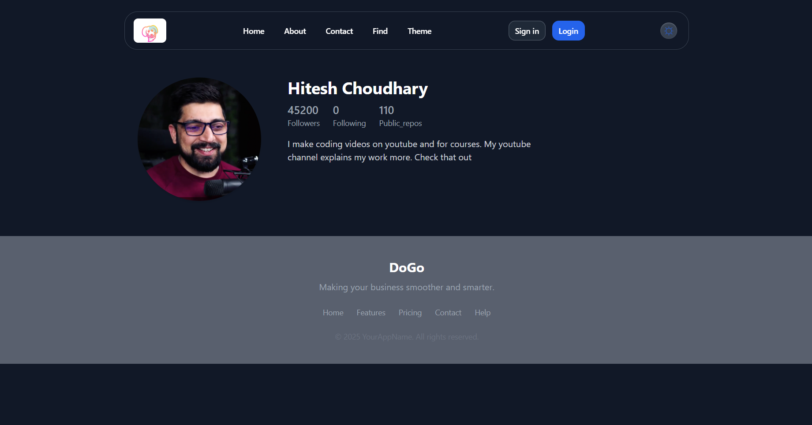

# React + Vite

This template provides a minimal setup to get React working in Vite with HMR and some ESLint rules.

Currently, two official plugins are available:

- [@vitejs/plugin-react](https://github.com/vitejs/vite-plugin-react/blob/main/packages/plugin-react) uses [Babel](https://babeljs.io/) for Fast Refresh
- [@vitejs/plugin-react-swc](https://github.com/vitejs/vite-plugin-react/blob/main/packages/plugin-react-swc) uses [SWC](https://swc.rs/) for Fast Refresh

## Expanding the ESLint configuration

If you are developing a production application, we recommend using TypeScript with type-aware lint rules enabled. Check out the [TS template](https://github.com/vitejs/vite/tree/main/packages/create-vite/template-react-ts) for information on how to integrate TypeScript and [`typescript-eslint`](https://typescript-eslint.io) in your project.

## data from git hub api

javascript 
''' 
    {
  "login": "Virpal-Singh",
  "id": 179195868,
  "node_id": "U_kgDOCq5P3A",
  "avatar_url": "https://avatars.githubusercontent.com/u/179195868?v=4",
  "gravatar_id": "",
  "url": "https://api.github.com/users/Virpal-Singh",
  "html_url": "https://github.com/Virpal-Singh",
  "followers_url": "https://api.github.com/users/Virpal-Singh/followers",
  "following_url": "https://api.github.com/users/Virpal-Singh/following{/other_user}",
  "gists_url": "https://api.github.com/users/Virpal-Singh/gists{/gist_id}",
  "starred_url": "https://api.github.com/users/Virpal-Singh/starred{/owner}{/repo}",
  "subscriptions_url": "https://api.github.com/users/Virpal-Singh/subscriptions",
  "organizations_url": "https://api.github.com/users/Virpal-Singh/orgs",
  "repos_url": "https://api.github.com/users/Virpal-Singh/repos",
  "events_url": "https://api.github.com/users/Virpal-Singh/events{/privacy}",
  "received_events_url": "https://api.github.com/users/Virpal-Singh/received_events",
  "type": "User",
  "user_view_type": "public",
  "site_admin": false,
  "name": "DEVADA VIRPAL SINH ",
  "company": null,
  "blog": "",
  "location": null,
  "email": null,
  "hireable": null,
  "bio": "MCA student",
  "twitter_username": null,
  "public_repos": 5,
  "public_gists": 0,
  "followers": 1,
  "following": 4,
  "created_at": "2024-08-23T04:46:00Z",
  "updated_at": "2025-06-24T05:27:53Z"
}
'''
### output

